# Digital Image Analysis and Processing
In this simple project I had to apply Image Processing techniques and algorithms
to achieve a set of tasks on this image:  
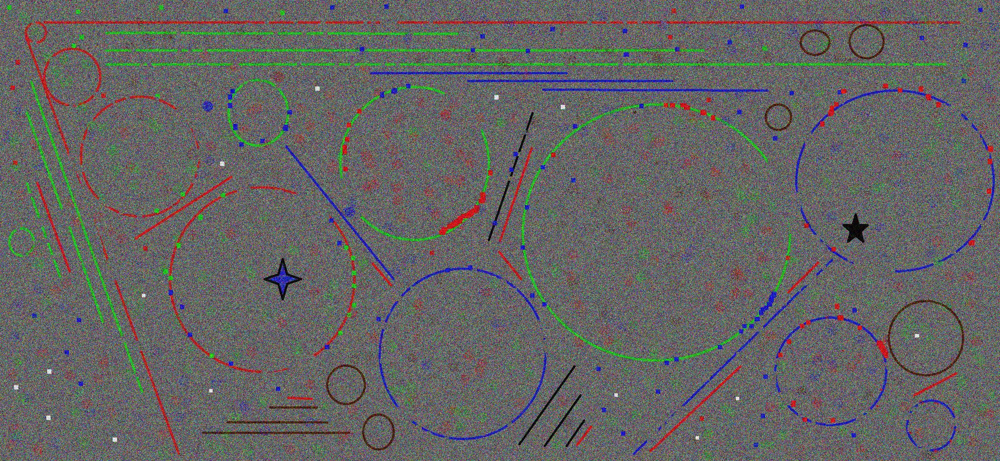 <br />

These are the tasks I had to achieve:  
- Fill the largest red circle with red color and color the longest red line with black.
- Fill the largest blue circle with blue color and color the longest blue line with yellow.
- Fill the largest green circle with green color and color the longest green line with magenta.  

# Filling the Circles
To detect the circles, the image has to go through multiple steps. I'll demonstrate
the steps on the green circle because it's the same process for all three colors.
### Filtering
First, I needed a way to extract the required color from the image. My first option was
taking the corresponding color channel and use it as a grey scale image.  

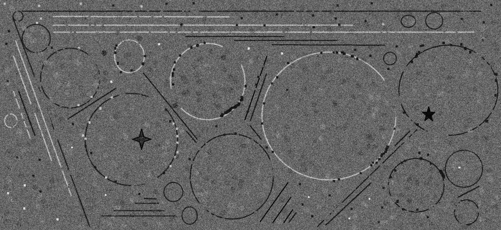 <br />

But this method includes a lot of the noise in the background. Thresholding helps a bit:

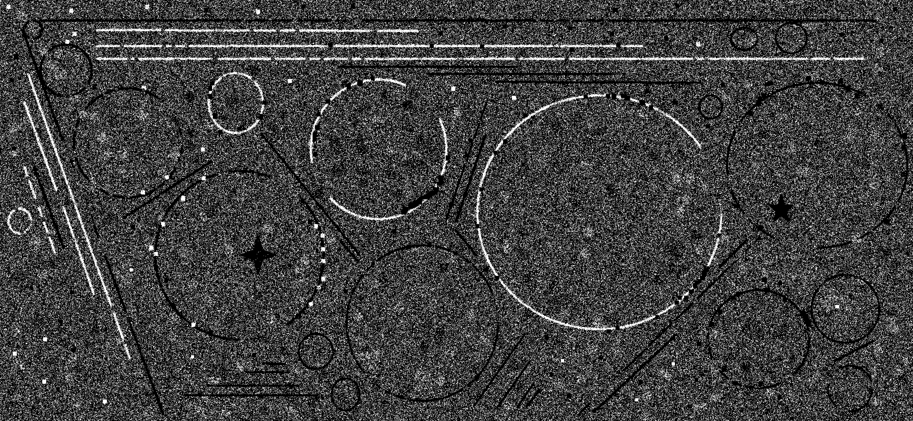 <br />

But it's still not great because the noise in the background has a lot of green.  
I needed a way to only include colors that are high on green _and_ have little
red and blue which that method couldn't achieve so, I decided to use color slicing instead:

 <br />

It still includes a lot of noise but it gives much better results because it only keeps the colors that are actually
close to the required color.  
Color slicing was done using these two functions:  
```python
def get_color(image, color):
    distance_from_color = find_color_distance(image, color)
    color_pixels = np.where(distance_from_color < COLOR_DISTANCE, 255, 0)
    return color_pixels.astype('uint8')


def find_color_distance(image, color):
    distance = image - color
    distance **= 2
    distance = distance.sum(axis=2)
    distance = distance ** 0.5

    return distance
```
Now we can get rid of the remaining noise using erosion with a disc of radius 3:

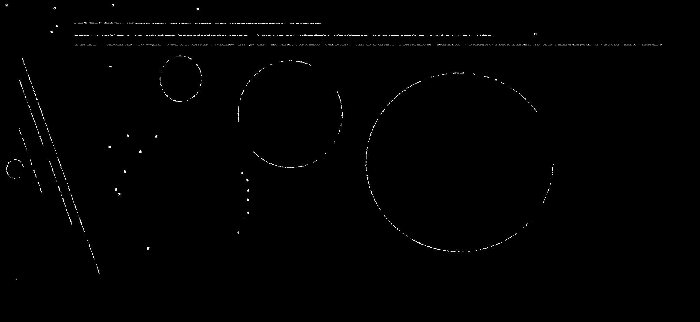 <br />

And then dilation to close the gabs in the circles and make them easier to detect circles:

 <br />

Here I used a radius of 5 with done on 3 iterations because that allow the image
to have a more natural growth than using one large radius on 1 iterations.
For erosion and dilation used the following functions:
```python
def erode(image, dimension, iterations):
    kernel = np.ones((dimension, dimension), np.uint8)
    eroded_image = cv2.erode(image, kernel, iterations=iterations)
    return eroded_image


def dilate(image, dimension, iterations):
    kernel = cv2.getStructuringElement(cv2.MORPH_ELLIPSE, (dimension, dimension))
    dilation_image = cv2.dilate(image, kernel, iterations=iterations)
    return dilation_image
```

The last step was to blur the image because currently the circles have rough edges which makes
detecting them a lot harder. So, we end up with the following image:  

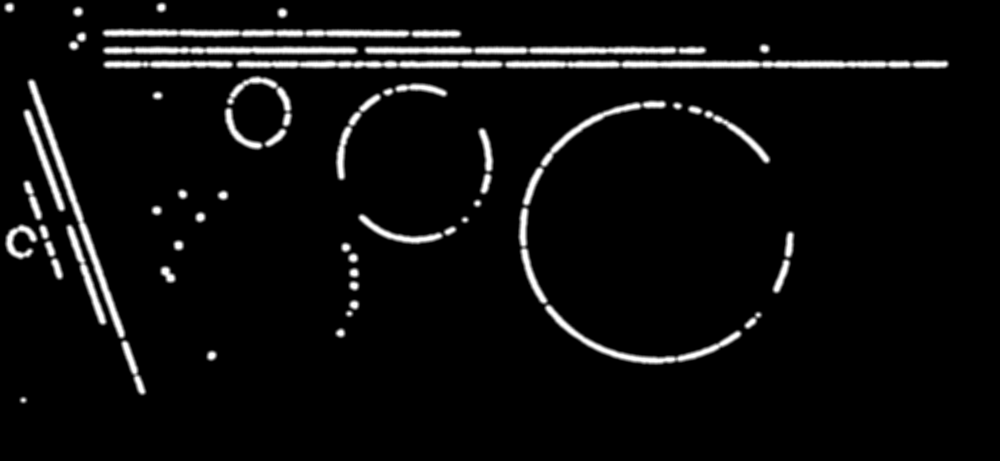 <br />

And for this operation I used the OpenCV built-in blur function:
```python
blurred_image = cv2.blur(filtered_image, (BLUR_DIMENSION, BLUR_DIMENSION))
```  

### Circle Detection
For circle detection I used Hough Transformation with the `HoughCircles` function provided
by OpenCV.
```python
circles = cv2.HoughCircles(image, cv2.HOUGH_GRADIENT,
                           dp=HOUGH_CIRCLE_DP,
                           minDist=HOUGH_CIRCLE_MIN_DIST,
                           param1=HOUGH_CIRCLE_CANNY_THRESH,
                           param2=HOUGH_CIRCLE_ACCUMULATOR_THRESH)
```

And I got the following result:

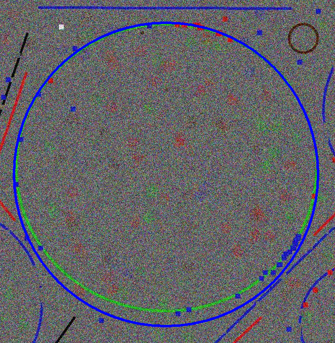 <br />

Hough Transformation is fairly accurate but as you can see it covers extra
area outside the circle. And it was even worse with the blue circle:

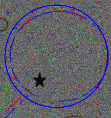 <br />

I wasn't happy with the results and after some inspection
I found out that the green circle has a height of around 590 pixels
and a height of 620 pixels. Same with the blue circle which has a height of 420 pixels and width of 460 pixels.
Which means these aren't uniform circles but are actually ellipses so I had to do one more step.

### Ellipse Detection
In this step I used the detected circles in the previous step as a rough approximation
of the location of the ellipses taking only the area around it. For the green ellipse we get:

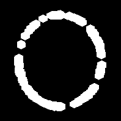 <br />

Then, from the center of the image, the code goes in all four directions till it finds the first edge
in each direction with these functions:

```python
def find_first_in_x_direction(segment, center, direction):
    y_center, x_center = center
    inf = segment.shape[1]
    row_width = COLUMN_WIDTH // 2
    x = x_center
    while True:
        x += direction
        if x not in range(0, inf):
            return None
        for y in range(y_center - row_width, y_center + row_width):
            if segment[y, x] != 0:
                return x


def find_first_in_y_direction(segment, center, direction):
    x_center, y_center = center
    inf = segment.shape[0]
    column_width = COLUMN_WIDTH // 2
    y = y_center
    while True:
        y += direction
        if y not in range(0, inf):
            return None
        for x in range(x_center - column_width, x_center + column_width):
            if segment[y, x] != 0:
                return y
```

This can be demonstrated in the following figure:

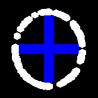 <br />

This function isn't optimal and has a lot of room for improvement as it is
error prone and can fail from a single noisy pixel inside the ellipse.
Moreover, if an ellipse had a discontinuity in one of the four directions,
it won't be able to detect that edge.  
But I decided to keep it for now as it works really well on all of the circles
in our image.
Finally, I add this value to detected edges:
```python
(DILATION_DIMENSION * DILATION_ITERATIONS - EROSION_DIMENSION * EROSION_ITERATIONS + CIRCLE_THICKNESS) // 2
```
Which compensates for the difference in thickness caused by the dilation and erosion operations
and adds the thickness of the actual circle borders so they can be covered too.  
And then I use the resulting values to fill the ellipse so we end up with the following result:

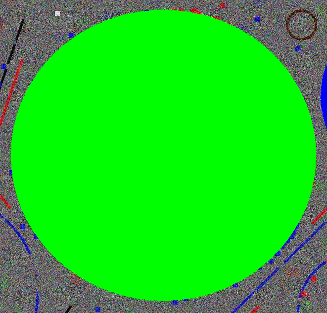 <br />

And if we turn down the opacity of the filling color:

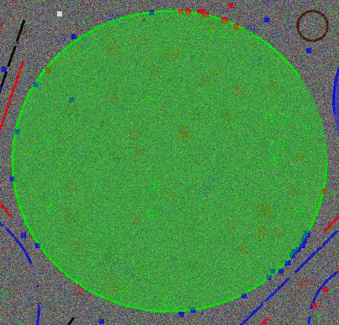 <br />

We can see now it covers the original ellipse perfectly. Same with blue and red ellipses:

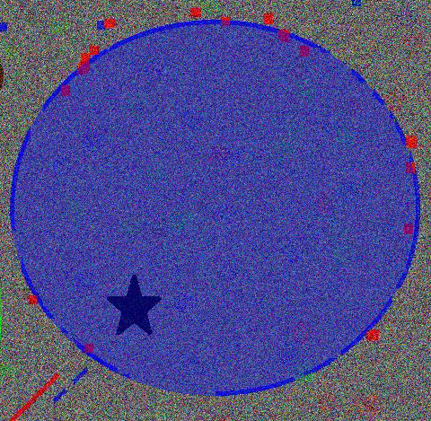 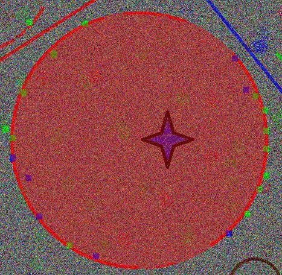

Here's the resulting image:  


# Line Detection
For line detection I used Hough Transformation as well but, it required
different filtration method.  
Here I first use the same color slicing method then perform the closing operation instead
because here noise isn't as big of an issue and we need to conserve the original shape of lines
as much as possible. So, I perform dilation first with radius 4 then erosion with radius 3
without any blurring to get this:

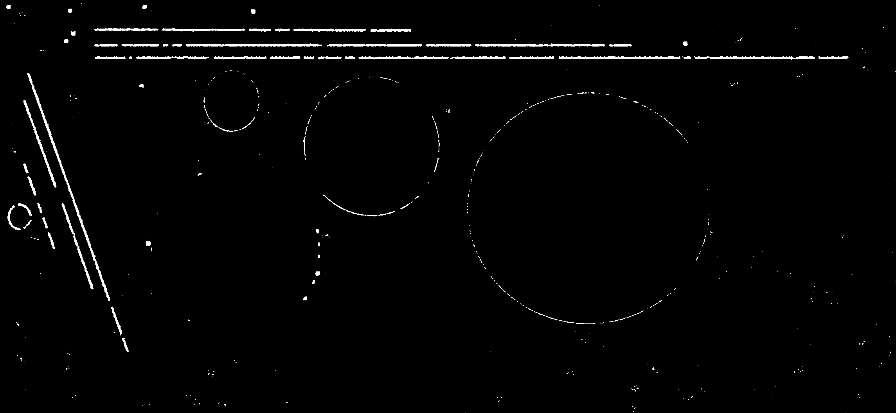

Now I use the `HoughLinesP` method provided in OpenCV and pick the longest line and draw it.  
```python
lines = cv2.HoughLinesP(filtered_image,
                        rho=HOUGH_LINES_RHO,
                        theta=HOUGH_LINES_THETA,
                        threshold=HOUGH_LINES_THRESH,
                        minLineLength=HOUGH_LINES_MIN_LINE,
                        maxLineGap=HOUGH_LINES_LINE_GAP)
```
I faced an issue with the blue line because it's really close to a blue circle
so it was extending and overlapping the circle thinking it was part of it so,
I used methods mentioned in the circles section to black out all of the RGB circles
from the image before trying to detect the lines so I got this result:


And that solved the issue. Here's the resulting image:  


# Conclusion
Adding the two resulting images we get this final image:


The green ellipse is centered at (1503, 532) and has a major length of 308
and minor length of 294.  
The blue ellipse is centered at (2048, 414) and has a major length of 226
and minor length of 209.  
The red ellipse is actually a circle and is centered at (600, 640) and has a radius of 213.  

The green, blue and red lines are 1923, 637.19 and 2116 pixels long respectively.

I tried to keep my code as general as possible so it would work on any
generally similar image to the one I was working on. These constants at the beginning of my code
can be fine tuned to fit any image:

```python
BLUR_DIMENSION = 9
COLOR_DISTANCE = 150
CIRCLE_EROSION_DIMENSION = 3
CIRCLE_EROSION_ITERATIONS = 1
CIRCLE_DILATION_DIMENSION = 5
CIRCLE_DILATION_ITERATIONS = 3
HOUGH_CIRCLE_DP = 1
HOUGH_CIRCLE_MIN_DIST = 100
HOUGH_CIRCLE_CANNY_THRESH = 20
HOUGH_CIRCLE_ACCUMULATOR_THRESH = 80
COLUMN_WIDTH = 20
CIRCLE_THICKNESS = 6

LINE_DILATION_DIMENSION = 4
LINE_DILATION_ITERATIONS = 1
LINE_EROSION_DIMENSION = 3
LINE_EROSION_ITERATIONS = 1
HOUGH_LINES_RHO = 10
HOUGH_LINES_THETA = np.pi / 180
HOUGH_LINES_THRESH = 100
HOUGH_LINES_MIN_LINE = 200
HOUGH_LINES_LINE_GAP = 60
LINE_SHIFT = 0
LINE_THICKNESS = 6
```
